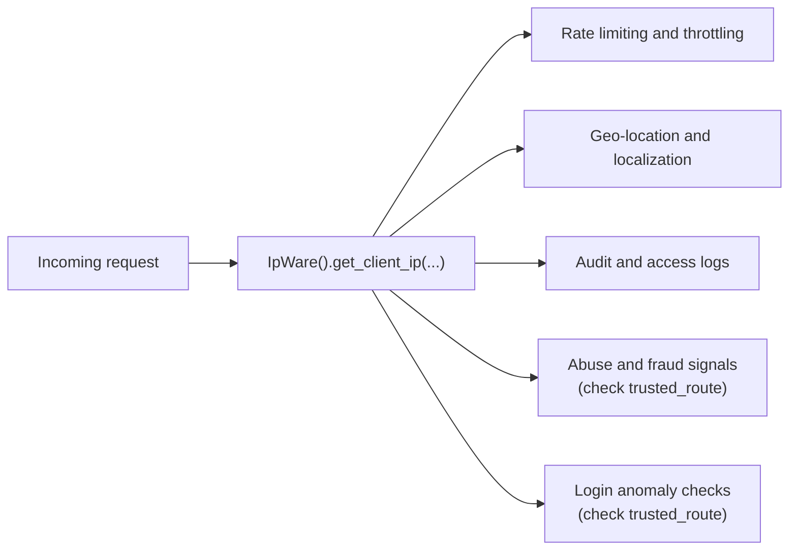
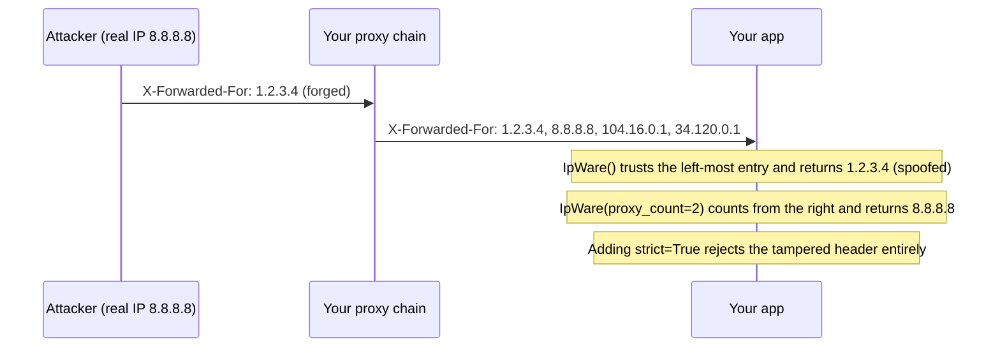
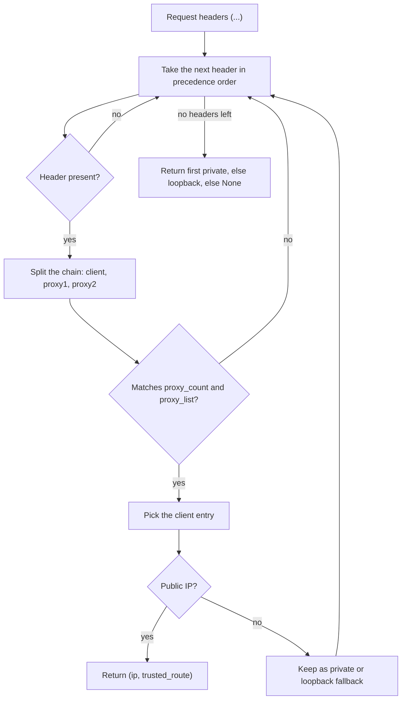
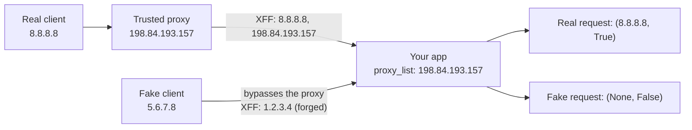
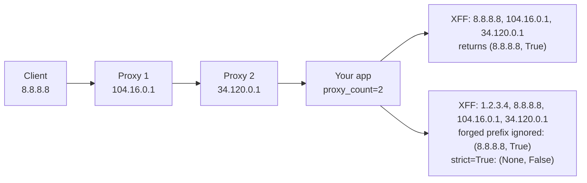
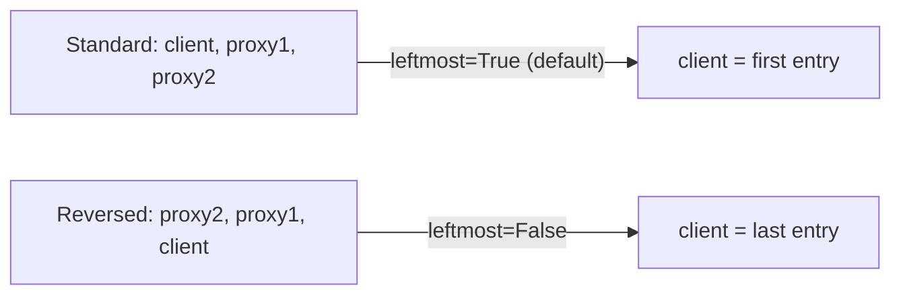

# Python IPware

Best-effort client IP detection for Python server applications — Django, Flask, or any WSGI/ASGI framework.

[![status-image]][status-link]
[![version-image]][version-link]
[![coverage-image]][coverage-link]
[![maintained-image]][maintained-link]

## Quickstart

```sh
python -m pip install --upgrade python-ipware
```

```python
from python_ipware import IpWare

ipw = IpWare()

# Django: request.META  |  Flask: request.environ
ip, trusted_route = ipw.get_client_ip(request.META)

if ip:
    # ip is an ipaddress.IPv4Address or IPv6Address
    ip.is_global     # publicly routable
    ip.is_private    # private network
    ip.is_loopback   # 127.0.0.1 / ::1

if trusted_route:
    # the request came through your configured proxies (proxy_count / proxy_list)
    ...
```

Python 3.9 – 3.13 is supported. No runtime dependencies.

> **Legacy:** the frozen 3.x algorithm is still available with `IpWare(algorithm="legacy")`.
> See the [legacy guide](https://github.com/un33k/python-ipware/blob/main/python_ipware/legacy/README.md).

## What it's used for



## Security notice

There is no perfect defense against IP address spoofing. Headers such as `X-Forwarded-For` are set by
clients and proxies, and can be forged. If you use `python-ipware` for authentication, rate limiting, or
anti-fraud, configure `proxy_count` and/or `proxy_list` for your network topology and treat it as one
layer alongside your firewall — never as the only defense.



## API

```python
IpWare(
    precedence=None,     # tuple of header keys to check, in order
    leftmost=True,       # client is the left-most IP in the chain
    proxy_count=None,    # expected number of proxies in front of your server
    proxy_list=None,     # trusted proxy IP prefixes
)

ip, trusted_route = ipw.get_client_ip(meta, strict=False)
```

| Parameter | Description |
| --- | --- |
| `precedence` | Header keys to search, top to bottom. Defaults to the list below. |
| `leftmost` | `True` (default) follows the de-facto `client, proxy1, proxy2` order. Use `False` only for networks that put the client right-most. |
| `proxy_count` | Number of proxies expected after the client. `0` is valid; `None` disables the check. |
| `proxy_list` | Trusted proxy prefixes, e.g. `["10.1.", "198.84.193.157"]`, matched against the proxies nearest your server. |
| `strict` | `False`: at least `proxy_count` / `proxy_list` proxies. `True`: exactly that many — extra or invalid entries reject the header. |

| Output | Description |
| --- | --- |
| `ip` | `IPv4Address`, `IPv6Address`, or `None` |
| `trusted_route` | `True` when `proxy_count` or `proxy_list` was configured and matched |

### Selection rules

Headers are checked in precedence order. The first **public** IP found wins; otherwise the first
**private** IP; otherwise the first **loopback** IP; otherwise `None`.



Ports are stripped (`1.2.3.4:8080`, `[2001:db8::1]:443`) and IPv4-mapped IPv6 addresses
(`::ffff:1.2.3.4`) are returned as plain IPv4.

## Default header precedence

```python
(
    "X_FORWARDED_FOR",           # load balancers / proxies (AWS ELB, etc.)
    "HTTP_X_FORWARDED_FOR",
    "HTTP_CLIENT_IP",            # Amazon EC2, Heroku
    "HTTP_X_REAL_IP",
    "HTTP_X_FORWARDED",          # Squid
    "HTTP_X_CLUSTER_CLIENT_IP",  # Rackspace LB, Riverbed Stingray
    "HTTP_FORWARDED_FOR",        # RFC 7239
    "HTTP_FORWARDED",            # RFC 7239
    "HTTP_CF_CONNECTING_IP",     # Cloudflare
    "HTTP_TRUE_CLIENT_IP",       # Cloudflare Enterprise, Akamai
    "HTTP_FASTLY_CLIENT_IP",     # Fastly, Firebase
    "HTTP_X_APPENGINE_USER_IP",  # Google App Engine
    "X-CLIENT-IP",               # Microsoft Azure
    "X-REAL-IP",                 # NGINX
    "X-CLUSTER-CLIENT-IP",       # Rackspace Cloud Load Balancers
    "X_FORWARDED",
    "FORWARDED_FOR",
    "CF-CONNECTING-IP",
    "TRUE-CLIENT-IP",
    "FASTLY-CLIENT-IP",
    "FORWARDED",
    "CLIENT-IP",
    "REMOTE_ADDR",               # direct connection
)
```

Narrow it to what your infrastructure actually sets:

```python
ipw = IpWare(precedence=("HTTP_X_FORWARDED_FOR", "REMOTE_ADDR"))
```

## Trusted proxies

If your server sits behind known proxies, pass their IPs or prefixes:

```python
ipw = IpWare(proxy_list=["198.84.193.157"])            # one proxy
ipw = IpWare(proxy_list=["198.84.193.157", "198.84.193.158"])  # two proxies
ipw = IpWare(proxy_list=["177.139.", "177.140"])       # prefixes for dynamic IPs

# non-strict — X-Forwarded-For: <fake>, <client>, <proxy1>, <proxy2>
ip, trusted_route = ipw.get_client_ip(request.META)

# strict — X-Forwarded-For must be exactly: <client>, <proxy1>, <proxy2>
ip, trusted_route = ipw.get_client_ip(request.META, strict=True)
```



## Proxy count

If you know how many proxies are in front of you but not their IPs (for example, across providers):

```python
ipw = IpWare(proxy_count=2)

# non-strict — at least 2 proxies
ip, trusted_route = ipw.get_client_ip(request.META)

# strict — exactly 2 proxies: <client>, <proxy1>, <proxy2>
ip, trusted_route = ipw.get_client_ip(request.META, strict=True)
```



Combine both for the tightest check:

```python
ipw = IpWare(proxy_count=1, proxy_list=["198.84.193.157"])
```

## Right-most client networks

The [de-facto standard](https://developer.mozilla.org/en-US/docs/Web/HTTP/Headers/X-Forwarded-For) puts the
originating client left-most. For the rare network that puts it right-most:

```python
ipw = IpWare(leftmost=False)
```



See [docs/nginx.md](https://github.com/un33k/python-ipware/blob/main/docs/nginx.md) for an NGINX configuration example.

## Development

```sh
python -m pip install -e '.[dev]'
ruff check .
python -m unittest discover -s tests -p "tests_*.py"   # full suite
python -m tests.legacy.run_against_legacy             # v3 suite against the legacy engine
python -m build && python -m twine check dist/*
```

## License

Released under the [MIT](https://github.com/un33k/python-ipware/blob/main/LICENSE) license.

## Maintenance

`python-ipware` is actively maintained with [Dojo](https://heydojo.ai) ⛩️. The legacy engine is frozen for
backward compatibility; all improvements target the modern engine. Need support? Reach
[Neekware Inc.](https://neekware.com) at info@neekware.com.

## Sponsors

[Neekware Inc.](https://neekware.com) — creator of [Dojo Workspace](https://heydojo.ai), your AI workspace for building, learning, and getting things done.

🚀 Created with [Dojo](https://heydojo.ai) ⛩️

[status-image]: https://github.com/un33k/python-ipware/actions/workflows/ci.yml/badge.svg
[status-link]: https://github.com/un33k/python-ipware/actions/workflows/ci.yml
[version-image]: https://img.shields.io/pypi/v/python-ipware.svg
[version-link]: https://pypi.org/project/python-ipware/
[coverage-image]: https://coveralls.io/repos/github/un33k/python-ipware/badge.svg?branch=main
[coverage-link]: https://coveralls.io/github/un33k/python-ipware?branch=main
[maintained-image]: https://img.shields.io/badge/maintained%20with-Dojo%20%E2%9B%A9%EF%B8%8F-1f2937
[maintained-link]: https://heydojo.ai
